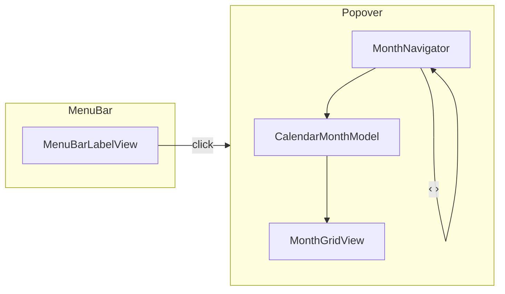

# macData Menu Bar Calendar — Design Spec

**Date:** 2026-06-15  
**Status:** Implemented (MVP)  
**Project:** macData (greenfield)

## Problem

Clicking the system date/time in the macOS menu bar does not show a month calendar grid. To see which weekday a date falls on, the user must open Calendar.app or navigate widgets — too many steps for a frequent lookup.

## Goal

A lightweight menu bar utility that:

1. Shows date/time in the menu bar (replacing the system clock after setup).
2. On click, opens a popover with the **current month** as a weekday grid.
3. Allows navigating **one month back / forward**.
4. Highlights **today** so the current date is obvious at a glance.

**Non-goal for MVP:** events, reminders, Calendar.app integration, year picker, App Store distribution.

## UX

### Menu bar label

- Displays localized date/time similar to macOS (e.g. `Пн 15 июн. 14:32`).
- Updates every minute; seconds omitted in MVP.
- Uses `Locale.current` and `Calendar.current` (week starts Monday when locale dictates).

### Popover (on click)

```
        ‹   Июнь 2026   ›
  Пн  Вт  Ср  Чт  Пт  Сб  Вс
                  1   2   3
   4   5   6   7   8   9  10
  ...
```

- **‹ / ›** — previous / next month (can cross year boundaries).
- **Today** — distinct style (ring or accent fill).
- **Day tap** — optional highlight only; does **not** open Calendar.app or create events.
- **Close** — click outside popover or click menu bar label again.

### First launch — onboarding

Because the system clock cannot be intercepted via public API, the app **replaces** it:

1. Onboarding screen explains: two clocks look wrong; hide Apple’s clock once.
2. Primary button: **«Скрыть системные часы»**.
3. On tap: attempt semi-automatic hide (see System clock setup below).
4. On failure: show short manual path (*Системные настройки → Пункт управления → Часы → убрать из строки меню*) or open System Settings if a deep link works on the user’s macOS version.
5. **Skip** allowed — app works with two menu bar items until user hides system clock.
6. Setting **«Скрыть системные часы»** remains in Preferences for re-run after macOS updates.

### Out of scope (MVP)

- Global hotkey (future).
- Custom date format picker (future).
- iCloud / EventKit.
- App Store sandbox build.

## Architecture

### Approach

Native **Swift + SwiftUI** macOS app using `MenuBarExtra` (macOS 13+). No dock icon (`LSUIElement` / `Application is agent (UIElement)`).

Single Xcode target inside `macData/`:

```
macData/
├── MacDataCalendar.xcodeproj
├── MacDataCalendar/
│   ├── MacDataCalendarApp.swift      # @main, MenuBarExtra
│   ├── MenuBarLabelView.swift        # date/time in menu bar
│   ├── CalendarPopoverView.swift     # popover UI shell
│   ├── MonthGridView.swift           # weekday headers + day cells
│   ├── MonthNavigator.swift          # ‹ › actions, title string
│   ├── CalendarMonthModel.swift      # pure month grid logic (testable)
│   ├── SystemClockHider.swift        # defaults + Control Center restart
│   ├── OnboardingView.swift          # first-run + hide clock CTA
│   ├── SettingsView.swift            # re-run hide clock, about
│   └── Assets.xcassets
└── MacDataCalendarTests/
    └── CalendarMonthModelTests.swift
```

### Component responsibilities

| Unit | Responsibility |
|------|----------------|
| `MacDataCalendarApp` | App lifecycle, `MenuBarExtra`, onboarding gate, inject `MonthNavigator` state |
| `MenuBarLabelView` | Formatted now-line for status item |
| `CalendarPopoverView` | Layout: navigator + grid |
| `MonthGridView` | Renders 6×7 grid from model; today styling |
| `MonthNavigator` | `ObservableObject`: visible month `Date`, `goToPreviousMonth()`, `goToNextMonth()`, `resetToToday()` |
| `CalendarMonthModel` | Given `(year, month, calendar)` → array of day cells with weekday column, leading blanks, `isToday` |
| `SystemClockHider` | Run hide-clock command; return success/failure enum |
| `OnboardingView` | One-screen flow; persists `hasSeenOnboarding` |

### Data flow



- **State:** `MonthNavigator.displayedMonth` defaults to start of current month; navigator mutates on ‹ ›.
- **Persistence:** `UserDefaults` keys `hasSeenOnboarding` (Bool).
- **No network, no database.**

### System clock setup (`SystemClockHider`)

Not a public API — **best-effort** for Ventura / Sonoma / Sequoia:

1. `defaults write com.apple.controlcenter "NSStatusItem Visible Clock" -bool false`
2. `killall ControlCenter` (or documented equivalent to refresh menu bar)

Returns:

- `.success`
- `.failed(reason: String)` — show manual instructions

**Never** run silently on every launch; only on explicit user button press.

### Error handling

| Situation | Behavior |
|-----------|----------|
| Hide clock fails | Inline error + manual steps; app continues |
| Unknown macOS version | Same fallback |
| Two clocks visible | Expected until user completes setup; no nag after skip |
| Month navigation at year boundary | `Calendar` API handles Dec ↔ Jan |

### Testing

| Level | What |
|-------|------|
| **Unit** | `CalendarMonthModel`: correct weekday column for known dates; Monday-first; Feb leap year; leading/trailing empty cells |
| **Unit** | Month navigation: Dec 2026 + 1 → Jan 2027 |
| **Manual** | Popover opens/closes; today highlight; onboarding skip and hide-clock button |

### Platform

- **Minimum:** macOS 13 (Ventura) — `MenuBarExtra` with `.window` style popover.
- **Build:** Xcode 15+, Swift 5.9+.
- **Distribution:** local build / `.app` in repo or `build/` (no signing requirement for personal use in MVP).

## Alternatives considered

| Option | Why not chosen |
|--------|----------------|
| SwiftBar plugin | Weaker native UX; extra dependency |
| CGEvent click interception on system clock | Fragile; breaks on layout changes |
| Electron / Tauri | Heavy for a menu bar calendar |

## Success criteria

1. User hides system clock (manually or via button) and sees one date/time item from MacDataCalendar.
2. Click shows month grid for current month with correct weekday headers.
3. ‹ › switches months correctly including year rollover.
4. Today is visually distinct.
5. Calendar grid logic covered by unit tests.

## Open questions (resolved)

| Question | Decision |
|----------|----------|
| Click system clock directly? | No — replace with own menu bar item after hiding Apple clock |
| Auto-hide system clock on launch? | No — one explicit button + fallback |
| Day click action? | Highlight only; no Calendar.app |
| Week start | Follow `Calendar.current` (Monday for `ru_*` locales) |
